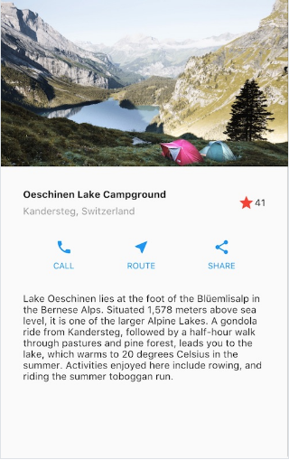

# IoT Projekt

Välkommen till vårens första projekt, där vi ska bygga ett smart system som dels består av en mobilapp och en IoT enhet.

Projektet är uppdelat i två delar.

## DEL 1 Flutter

## Övningar

### Övning 0 - Installera Flutter

Installera Flutter. Följ instruktionerna på länken.

<a href="https://docs.flutter.dev/get-started/install/windows">https://docs.flutter.dev/get-started/install/windows</a>

## Övning 1 - Skapa övningsprojekt

Skapa ett första övningsprojekt och starta det i webbläsaren.

<a href="https://docs.flutter.dev/get-started/test-drive">https://docs.flutter.dev/get-started/test-drive</a>

## Övning 2 - Vanliga Widgets

Skapa den här vyn genom att orientera dig med några av de vanligaste Widget i Flutter.

<a href="https://docs.flutter.dev/development/ui/layout/tutorial">https://docs.flutter.dev/development/ui/layout/tutorial</a>

## Övning 3 - Navigering mellan sidor

1. Skapa en mapp som heter pages.
2. Skapa två widgets page1.dart och page2.dart med mall-kod.
3. Navigera med mellan sidorna.

## Övning 4 - Jobba med listor

1. Skapa en lista med objekt om länder som innehåller egenskaperna id, country, city.
2. Använd ListView för presentera länderna i en lista.

# Övning 5 - Jobba med Firebase

Koppla Flutter projektet till Firebase Realtime DB.
